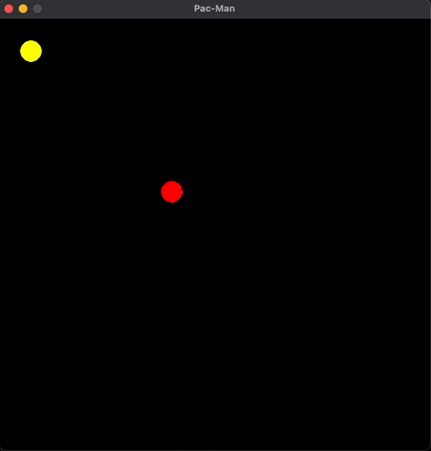
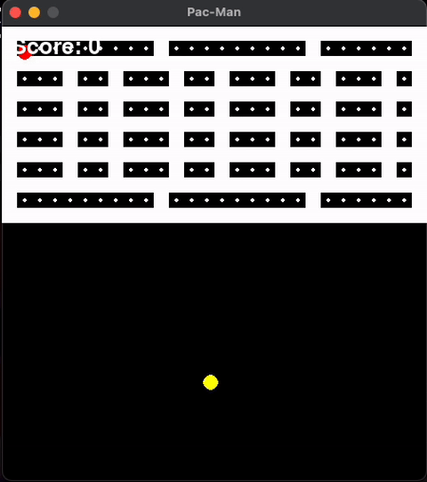
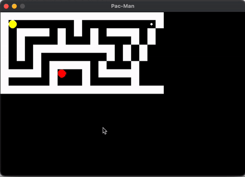
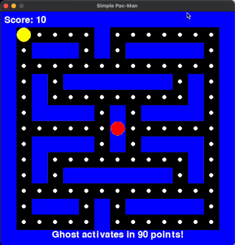
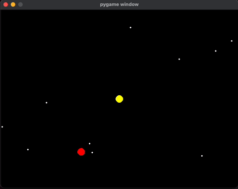
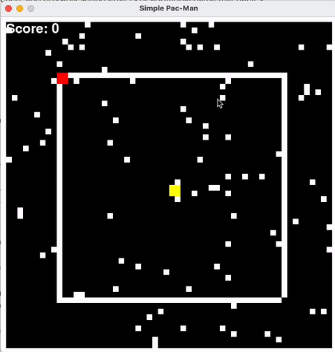

## Pacman by AI

Inspired by a "[Bouncing Snake Challenge](https://www.linkedin.com/posts/thejamesliu_coding-spatialreasoning-simulation-activity-7291273910505943041-8x2C?utm_source=share&utm_medium=member_desktop&rcm=ACoAAAd-RJEBNcnWdmeKw1PrdfxG1FmGxHVhmEs)" post on Linkedin, I created a test of the well known LLMs. The experiment is set to see which LLM can provide a best code for a starter game.  The candidate lists:

 - ChatGPT 4o from OpenAI
 - Gemini 2.0 Flash from Google
 - DeekSeek R1 
 - Claude3.5 Sonnet from Anthropic
 - LLaMA 3 from Meta
 - Grok 2 from xAI


#### *Prompt*:
Make a simple one-level Pac-Man game using Python. The game includes:
-   A Pac-Man character that moves with arrow keys
-   A basic maze with walls
-   Pellets to collect; each eaten pellets adds 10 points to the total score
-   A single ghost that chases Pac-Man

## ChatGPT

The python program crashed immediately due to exception:

```
if maze[y][x] == 1:  # Walls
~~~~^^^
IndexError: list index out of range
```
 
***Prompt #2***: There is a list index out of range on line 104. Can you fix this error and any other potential boundary issue in the code?

***Prompt #3***: Please check for any other potential out-of-bounds index in the code and fix them

***Prompt #4***: Are you sure they are all checked? It appears that line 101 still encounters out of bound error when running the game.

And so on... finally, a non crashing game look like this:


## Gemini
The program crashed immediately due to exception:
```
if maze[pacman_grid_y][pacman_grid_x] != "1": # Check if it's not a wall
~~~
~^^^^^^^^^^^^^^^
IndexError: list index out of range
```

***Prompt#2***: There is a list index out of range on line 90. Can you fix this error and any other potential boundary issue in the code?
Gemini was able to fix this in the second try.




## DeepSeek
The code was able to run at first launch. But it contains following findings:
-   Map size issue
-   Pellets placement issue
-   Has path issues for the maze
-   Code crash on boundary error later

The good thing is it allows the Pacman to start first.


## Claude 
-   Nice looking Maze, resembles the first level of the classic game!
-   Ghost moves too fast to end the game
After adding another threshold, I got to play for a bit longer.
#### *Prompt #2:*
Make the ghost start moving only after collecting enough pellets to score 100 points.



## Llama
Llama definitely  does not seem to be a good model for designing a game.
-   Failed to understand the spec - no wall, random pellets, no scores
-   It didn’t even name the window title
-   The layout had all closed wall and there is no path to run
-   Placement of Pacman and ghost are strange and wrong


## Grok
Grok doesn't seem to have knowledge of what a Pacman game look like at all.
-   The program kinda works like a chasing game.
-   There is no waiting for user to start
In order to show if the controls work, adding another prompt:

***Prompt #2***:  Ghost starts moving after Pacman gets 100 points.



## Conclusion
Anthropic's Claude Sonnet seems to be the best LLM to start a gaming project using the gamepy framework.  Not only it makes a reasonable UI and gameplay design, it actually had the knowledge of the original Pacman game.  In a later question to the LLM to ask if it knew about the oginial game layout, it confirmed the knowledge and made a simified version for that.  It was able to further to make a couple more layout similar to the other levels in the original game.

## How to test the code
1. Install pygame on your system: 
    ```pip install pygame```

2. Start the game from command line:
    ```python3 pacman.py```


## License
MIT
